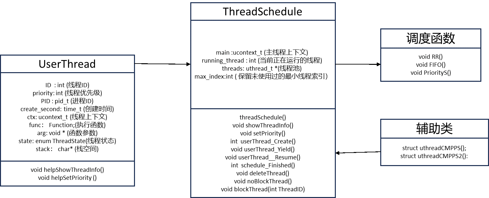

#	实验目标
基于国产麒麟操作系统环境（比如，银河麒麟V10），设计一个用户级线程库，支持用户级线程的创建、让步、退出、调度等管理工作，理解线程调度的原理及实现方法。调度算法包括先进先出，RR和优先级调度。
#	实验步骤
（1）创建一个线程库，能存储，管理线程；  
（2）创建线程：新建一个线程，并把它存储起来。一个线程的信息包括线程ID，线程的优先级，线程的进程ID，线程的创建时间，线程状态；  
（3）对于一个线程，其状态可能为：ready，running，blocked，需要设计维护线程状态的函数；  
（4）线程调度中还需要能更新线程优先级的函数。维护线程池允许用户查看各线程的信息。允许用户手动设置线程的优先级。假设在只有一个CPU的情况下，实现不同的调度算法，对线程进行调度。允许用户选择调度的算法。调度算法包含先进先出，RR，优先级；  
（5）线程的删除：删除线程及其消息  
（6）设计一个测试程序调用线程库中的函数验证所设计的线程库。  

#	实验相关概念和原理
## 用户级线程和内核级线程
主要的区别在于是否需要内核以及操作的直接支持和调度。内核级线程切换由内核控制，当线程进行切换的时候，由用户态转化为内核态。切换完毕要从内核态返回用户态。用户级线程内核的切换由用户态程序自己控制内核切换,不需要内核干涉，少了进出内核态的消耗。用户级线程和内核级线程的区别可以从以下几个方面进行阐释：
1.	执行环境:  
•	用户态线程完全在用户空间执行,不需要操作系统的调度和支持。  
•	内核态线程需要操作系统的调度和管理,能真正掌控CPU时间片,可以直接访问内核资源。
2.	调度:  
•	用户态线程由用户程序来调度,不受操作系统的调度策略影响。  
•	内核态线程由操作系统来进行调度,遵循操作系统的调度策略和优先级原则。  
3.	上下文切换:  
•	用户态线程上下文切换不需要进入内核模式,效率很高。  
•	内核态线程上下文切换需要进入内核模式,切换开销较大。  
4.	资源访问:  
•	用户态线程不能直接访问操作系统资源如内存、I/O等。  
•	内核态线程可以直接访问操作系统资源,不需要系统调用的支持。  
5.	并发能力:  
•	用户态线程无法充分发挥多核CPU的计算能力。  
•	内核态线程能充分利用多核并发执行能力。  
6.	管理控制:  
•	用户态线程完全由用户程序控制。  
•	内核态线程可以由操作系统直接管理和监控。  

## 用户态线程切换的原理及常见的实现方法
用户态线程切换的原理是通过为每个用户态线程单独分配一个TCB（Thread Control Block，线程控制块），里面包含线程私有数据（比如线程栈、程序计数器等），在切换线程时将上一个线程的上下文包括线程栈，寄存器值等切换到另一个线程。
目前来说利用C++语言实现用户态线程有以下几种方式：

第一种：利用glibc 的 ucontext组件
< ucontext.h > 中定义了两个结构类型，mcontext_t和ucontext_t和四个函数getcontext(),setcontext(),makecontext(),swapcontext().这些函数可以帮助创建和保存一个线程的上下文，省去了用户态线程在切换中繁琐地修改栈空间和寄存值等问题
第二种：使用汇编代码来切换上下文
直接使用汇编语言完成线程的上下文的切换，优点是全程可控，汇编语言执行更快，缺点是和c++语言混合使用时编程繁琐，容易出错。 
第三种：利用C语言语法switch-case。
由于switch-case 的分支跳转特性，以及预编译的 __LINE__ 宏，也可以实现类似的yield即线程切换的功能。
第四种：利用了 C 语言的 setjmp 和 longjmp，函数里面使用 static local 的变量来保存协程内部的数据。

## 线程调度方法
本次设计中涉及的线程调度方法有三种，分别是RR（时间片轮转调度法），FIFO（先进先出），优先级调度。
1.RR（时间片轮转调度法）的实现方法
在用户态线程库中，可以使用ctime头文件中的计时函数来记录一个线程的执行时间，通过循环执行线程直至达到时间片则切换另一个线程执行，即可实现时间片轮转调度方法
2.FIFO（先进先出）
FIFO实际上就是先创建的线程先被执行，由于线程中使用线程池进行管理线程，线程池本身并不使用队列的数据结构，所以可以通过创建小顶堆，让创建时间作为优先级，即可实现FIFO的线程调度
3.优先级调度
直接创建一个大顶堆，取堆顶元素执行线程即可。

#	实验步骤具体原理和关键核心代码
## 类及相关函数结构设计
函数设计如图4-1所示，主要设计有用户态线程类UserThread
和用户态线程调度器类ThreadSchedule，用户态线程类的成员有线程ID ，线程优先级，进程ID，创建时间，线程上下文，线程执行函数，函数参数，线程状态栈空间。


 
图4-1 类及相关函数结构设计
## 具体功能及对应函数实现
（1）创建一个线程库，能存储，管理线程；
ThreadScheduler中使用一个固定大小的线程数组进行模拟线程池。同时提供三种基础调度函数，线程创建userThread_Create、让步userThread_Yield、线程执行函数userThread_Resume。
线程创建函数userThread_Create：
函数思路如图4-2所示，函数创建思路如下：
```
1.	首先，通过遍历ThreadScheduler中的线程数组，找到一个状态为FREE的空闲位置，用于存储新创建的线程。这个位置是通过id变量表示的。
2.	如果找不到空闲位置，即id等于schedule.max_index，则表示当前线程数组已满，需要增加数组的大小。这里简单地将max_index增加1，以便能够容纳新的线程。
3.	创建一个指向UserThread结构体的指针t，并根据参数设置线程的ID、优先级、进程ID（PID）、创建时间，设置线程的函数指针和参数，将线程的状态设置为READY。
4.	使用getcontext()函数初始化线程的上下文，即将t->ctx设置为当前线程的上下文。
5.	设置线程的栈空间，指定栈的大小为DEFAULT_STACK_SZIE，将其与线程的上下文关联起来。
6.	设置线程的上下文的链接指向schedule.main，即主线程的上下文。
7.	使用makecontext()函数将线程的上下文与线程函数userThread_Body关联起来。这个函数会在该线程执行时被调用。
8.	返回线程的ID。
代码如下：
1.	int userThread_Create(ThreadScheduler &schedule,Function func,void *arg,int priority )  
2.	{  
3.	    int id = 0;  
4.	    for(id = 0; id < schedule.max_index; ++id ){  
5.	        if(schedule.threads[id].state == FREE){  
6.	            break;  
7.	        }  
8.	    }  
9.	    if (id == schedule.max_index) schedule.max_index++;  
10.	    UserThread *t = &(schedule.threads[id]);  
11.	    t->ID = id ;//1.thread id  
12.	    t->priority = priority ; //2.priority  
13.	    t->PID = getpid() ;//3.PID  
14.	    std::time_t now = std::time(nullptr);  
15.	    std::tm* local_time = std::localtime(&now);//4.get time  
16.	    t->create_second = now;  
17.	    t->create_time = local_time ;  
18.	    t->func = func;  
19.	    t->arg = arg;  
20.	    t->state = READY;  
21.	    getcontext(&(t->ctx));  
22.	    t->ctx.uc_stack.ss_sp = t->stack;  
23.	    t->ctx.uc_stack.ss_size = DEFAULT_STACK_SZIE;  
24.	    t->ctx.uc_stack.ss_flags = 0;  
25.	    t->ctx.uc_link = &(schedule.main);  
26.	    //schedule.running_thread = id;  
27.	    makecontext(&(t->ctx),(void (*)(void))(userThread_Body),1,&schedule);  
28.	    //std::cout<<"thread create finished the info is as follows:"<<std::endl;  
29.	    //t->helpShowThreadInfo();  
30.	    //swapcontext(&(schedule.main), &(t->ctx));  
31.	    return id;  
32.	}  
```

图4-2 userThread_Create函数设计思路
线程让步函数：UserThread_Yield函数
函数设计思路如图4-3所示，函数总体思路如下：
```
1.	首先判断running_thread属性，如果schedule.running_thread不等于-1，表示当前有一个线程正在运行，就执行让步，否则没有线程运行，不必执行让步，直接退出。
2.	通过schedule.running_thread获取当前正在运行的线程的索引，并将其保存在指针变量t中。
3.	将运行线程的状态设置为给定的state参数，一般默认为READY状态，因为当前运行线程需要让步给其他线程，当前线程状态需要更新，如果是其他原因让步或者用户想要直接阻塞该线程，可以启用该参数并传入BLOCKED关键字设置。
4.	将schedule.running_thread设置为-1，表示当前没有线程在运行。
5.	使用swapcontext()函数将当前线程的上下文（t->ctx）与主线程的上下文进行切换。
代码如下：
1.	void userThread_Yield(ThreadScheduler &schedule,ThreadState state )  
2.	{  
3.	    //schedule.showThreadInfo();  
4.	    if(schedule.running_thread != -1 ){  
5.	        UserThread *t = &(schedule.threads[schedule.running_thread]);
6.	        t->state = state;  
7.	        schedule.running_thread = -1;  //设置当前未运行线程
8.	        swapcontext(&(t->ctx),&(schedule.main));  
9.	        puts("main");  
10.	    }  
11.	}  
```

 
图4-3线程让步函数：UserThread_Yield函数设计思路
线程执行函数userThread_Resume：
线程执行函数的设计思路如图4-4所示，思路具体如下：
```
1.	首先，检查传递给函数的id参数是否有效，即是否在线程数组的有效范围内。如果id小于0或大于等于schedule.max_index，则表示该id无效，函数直接返回。
2.	获取指定id对应的线程的指针
3.	检查线程的状态是否为READY。只有当线程状态为READY时，才能被恢复执行。
4.	将线程的状态设置为RUNNING，表示该线程正在运行。
5.	将schedule.running_thread设置为指定的id，以表示当前正在运行的线程是该线程。
6.	使用swapcontext()函数将主线程的上下文与指定线程的上下文进行切换。
代码如下：
1.	void userThread_Resume(ThreadScheduler &schedule , int id)  
2.	{  
3.	    if(id < 0 || id >= schedule.max_index)  return;//判断max_index  
4.	    UserThread *t = &(schedule.threads[id]);  
5.	    if (t->state == READY ) {  
6.	        t->state = RUNNING ;//set running  
7.	        schedule.running_thread  = id ;  
8.	        swapcontext(&(schedule.main),&(t->ctx));  
9.	    }//判断是否为ready再运行  
10.	}  
```

  
图4-4线程执行函数userThread_Resume设计思路
总之，这个函数的作用是恢复指定ID的线程的执行。它会将线程的状态设置为RUNNING，并使用swapcontext()函数将主线程的上下文与指定线程的上下文进行切换，从而使指定线程继续执行。

（2）创建线程：新建一个线程，并把它存储起来。一个线程的信息包括线程ID，线程的优先级，线程的进程ID，线程的创建时间，线程状态；
线程类的成员变量和成员函数如图1所示。
（3）对于一个线程，其状态可能为：ready，running，blocked，需要设计维护线程状态的函数，由于线程池预先分配定量大小的空间，所以新增一个状态FREE，用于表示未分配的线程其状态
线程状态切换情况分析如图4-5，具体切换情况如下：
(1)线程池分配线程
线程创建时，将线程放入线程池，并将原来的FREE状态赋值为ready
(2)执行线程
从线程池中取一个状态为READY的线程，将线程状态赋值为running，并运行线程
(3)阻塞线程
线程执行时将线程阻塞，将状态赋值为BLOCKED
(4)解除阻塞
线程阻塞时将线程阻塞状态接触，线程状态赋值为READY
(5)释放线程
线程执行后释放线程资源，将线程状态赋值为FREE

   
图4-5线程状态切换情况分析
（4）线程调度中还需要能更新线程优先级的函数。维护线程池允许用户查看各线程的信息。允许用户手动设置线程的优先级。假设在只有一个CPU的情况下，实现不同的调度算法，对线程进行调度。允许用户选择调度的算法。调度算法包含先进先出，RR，优先级；
分别编写了三种调度函数来帮助调度器调度线程
时间片调度算法设计如图4-6所示：
```
1.	循环从线程池中取出线程
2.	判断线程的状态是否为READY，如果是，即该线程可以被执行
3.	获取当前时间的时钟周期数，保存在clock_start变量中，用于后续计算时间间隔。 
4.	调用userThread_Resume函数恢复该线程的执行。
5.	获取当前时间的时钟周期数，保存在clock_end变量中。
6.	计算时间间隔(clock_end - clock_start) 
7.	如果时间间隔没有超过了设定的间隔时间gaptime， 则回到步骤4，否则继续执行步骤8
8.	如果调度仍没有完成，即仍存在状态为READY的线程，则回到步骤1
代码：
1.	void RR(ThreadScheduler &schedule,int gaptime ){  
2.	    while(!schedule_Finished(schedule)){  
3.	        for (int j = 0; j < schedule.max_index; j++) {  
4.	            std::clock_t clock_start = std::clock();  
5.	            while (schedule.threads[j].state == READY) {  
6.	                userThread_Resume(schedule, j);  
7.	                //schedule.showThreadInfo();  
8.	                std::clock_t clock_end = std::clock();  
9.	                std::cout<<"gap"<<(clock_end - clock_start)<< std::endl;  
10.	                if (clock_end - clock_start > gaptime) {puts("break");break;}  
11.	            }  
12.	        }  
13.	    }  
14.	} 
```

  
图4-6 时间片调度算法设计

优先级调度算法设计如图4-7所示：
```
1.	使用一个循环遍历线程数组，将所有状态为READY的线程加入到优先队列中，优先级用线程优先级表示
2.	从优先队列的顶部（最高优先级）取出一个线程
3.	调用userThread_Resume函数恢复线程的执行，传递线程的ID作为参数。
4.	如果该线程状态仍为READY，则跳回步骤3，否则执行步骤5
5.	如果队列非空，则回到步骤2，否则算法结束
代码如下：
1.	void PriorityS(ThreadScheduler &schedule){  
2.	    std::priority_queue<UserThread,std::vector<UserThread>,uthreadCMPPS> pq;//1.put data into priorityqueue  
3.	    for (int j = 0; j < schedule.max_index; j++) {  
4.	        if (schedule.threads[j].state == READY) {  
5.	            pq.push(schedule.threads[j]);  
6.	        }  
7.	    }  
8.	    while(!pq.empty())  
9.	    {  
10.	        UserThread  tmp= pq.top();  
11.	        int id = tmp.ID ;  
12.	        pq.pop();  
13.	        while(schedule.threads[id].state!=FREE) {  
14.	            userThread_Resume(schedule, id);  
15.	        }  
16.	    }  
17.	}  
```

   
图4-7优先级调度算法
FIFO先进先出算法，由于线程池设计时本身并非队列结构，所以需要重新排序，这里参考优先队列的思想，将创建时间作为优先级，选择创建时间早的作为高优先级，其他过程类似优先级调度算法。
代码如下：
```
1.	void FIFO(ThreadScheduler &schedule) {  
2.	    std::priority_queue<UserThread, std::vector<UserThread>, uthreadCMPPS2> pq;//1.put data into priorityqueue//1.put data into priorityqueue  
3.	    for (int j = 0; j < schedule.max_index; j++) {  
4.	        if (schedule.threads[j].state == READY) {  
5.	            pq.push(schedule.threads[j]);  
6.	        }  
7.	    }  
8.	    while (!pq.empty()) {  
9.	        UserThread tmp = pq.top();  
10.	        int id = tmp.ID;  
11.	        pq.pop();  
12.	        while (schedule.threads[id].state != FREE) {  
13.	            userThread_Resume(schedule, id);  
14.	        }  
15.	    }  
16.	}  
```

（5）线程的删除：删除线程及其消息
使用析构函数将线程从原有线程池中删除，并更新线程池状态
（6）设计一个测试程序调用线程库中的函数验证所设计的线程库。


 


 


